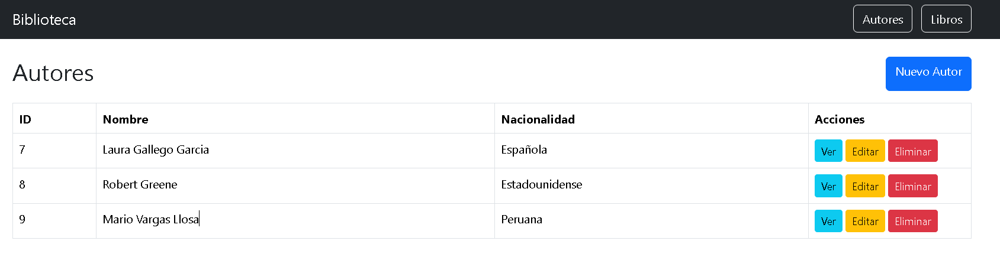
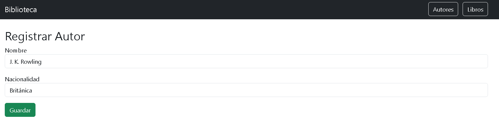
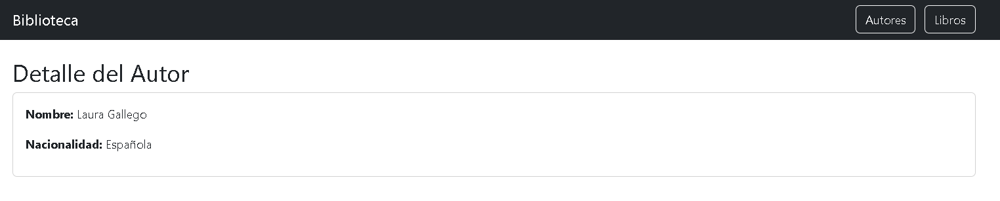
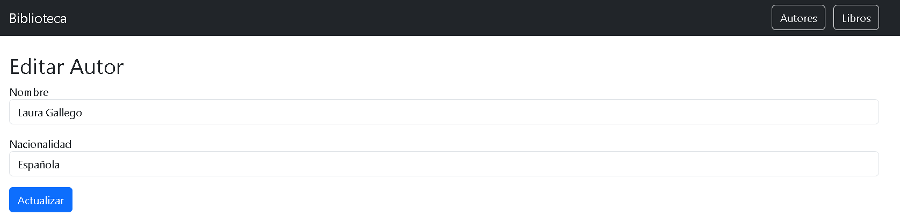
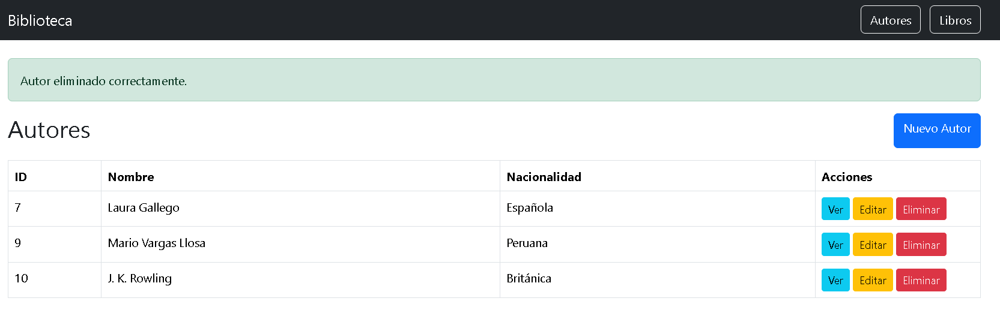
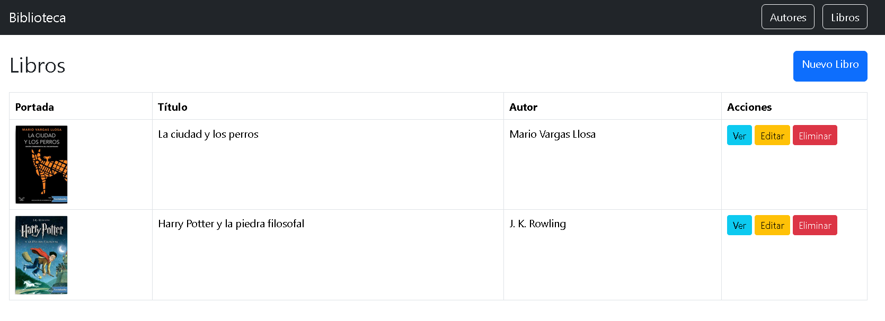
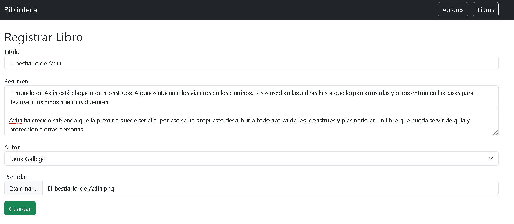
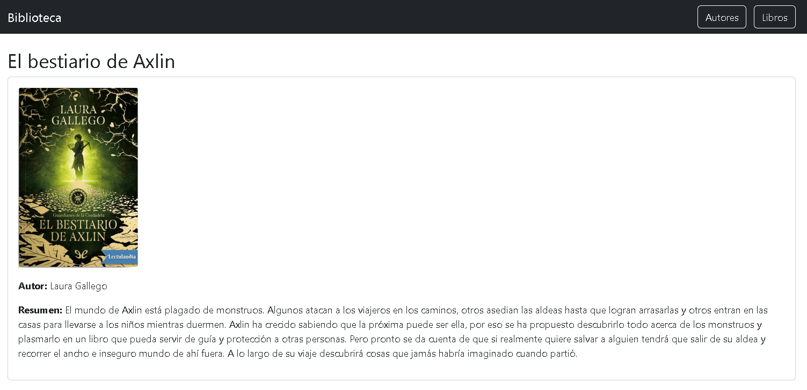
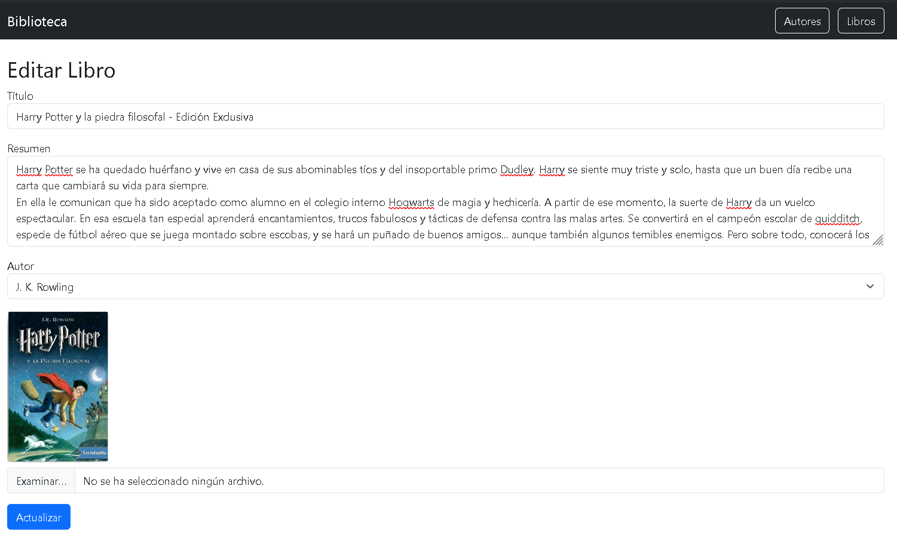
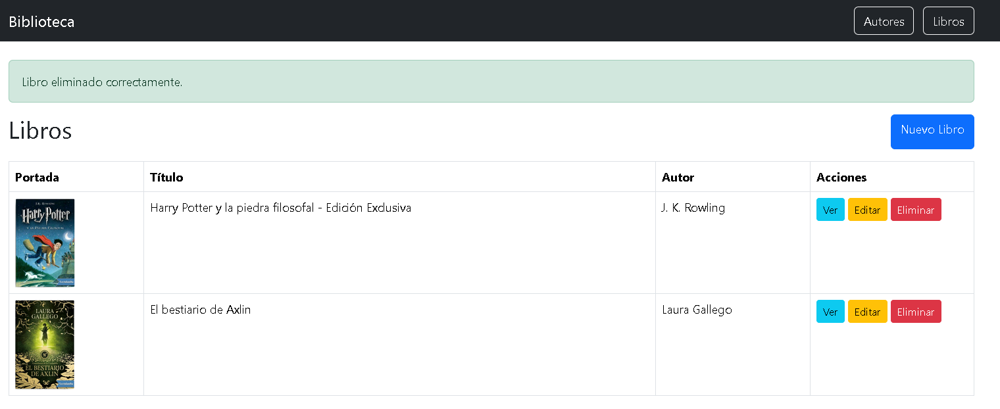

# Sistema de Gestión de Libros

Sistema web desarrollado con **PHP Laravel** y **MySQL** para la administración de autores y libros mediante operaciones CRUD (Crear, Leer, Actualizar y Eliminar).

## Tecnologías Utilizadas

- PHP
- Laravel
- MySQL
- Blade Templates
- HTML5
- CSS3
- Bootstrap
- Git
- GitHub

---

## Descripción del Proyecto

Este sistema permite gestionar información relacionada con autores y libros de manera eficiente mediante una interfaz web amigable.

### Funcionalidades principales

- Gestión de autores.
- Gestión de libros.
- Operaciones CRUD completas.
- Validación de formularios.
- Persistencia de datos en MySQL.
- Navegación intuitiva.

---

# Modelo de Datos

## Tabla: Autores

| Campo | Tipo |
|---------|---------|
| id | INT |
| nombre | VARCHAR |
| nacionalidad | VARCHAR |
| created_at | TIMESTAMP |
| updated_at | TIMESTAMP |

## Tabla: Libros

| Campo | Tipo |
|---------|---------|
| id | INT |
| titulo | VARCHAR |
| resumen | TEXT |
| portada | VARCHAR |
| autor_id | INT |
| created_at | TIMESTAMP |
| updated_at | TIMESTAMP |

---

#  Instalación y Configuración

## 1. Clonar el repositorio

```bash
git clone https://github.com/LesterCorrea/Gestion_de_Libros.git
```

## 2. Acceder al proyecto

```bash
cd Gestion_de_Libros
```

## 3. Instalar dependencias

```bash
composer install
```

## 4. Configurar variables de entorno

Copiar el archivo `.env`

```bash
cp .env.example .env
```

Configurar la conexión a MySQL:

```env
DB_CONNECTION=mysql
DB_HOST=127.0.0.1
DB_PORT=3306
DB_DATABASE=gestion_libros
DB_USERNAME=root
DB_PASSWORD=
```

## 5. Generar clave de aplicación

```bash
php artisan key:generate
```

## 6. Ejecutar migraciones

```bash
php artisan migrate
```

## 7. Iniciar servidor

```bash
php artisan serve
```

---

# Capturas del Sistema

## Listado de Autores



---

##  Inserción de un Nuevo Autor



---

##  Ver detalles de un Autor



---

##  Edición de un Autor



---

##  Eliminación de un Autor
Se eliminó a el autor: Robert Greene



---

##  Listado de Libros



---

##  Inserción de un Nuevo Libro



---

##  Ver detalles de un Libro



---

##  Edición de un Libro



---

##  Eliminación de un Libro
Se eliminó a el libro: La ciudad y los perros



---

#  Estructura General del Proyecto (Simplificada)

```text
Gestion_de_Libros/
│
├── app/
│   ├── Http/
│   │   └── Controllers/
│   └── Models/
│
├── database/
│   └── migrations/
│
├── public/
│
├── resources/
│   └── views/
│       ├── autores/
│       └── libros/
│
├── routes/
│   └── web.php
│
└── README.md
```

---

#  CRUD Implementados

## CRUD de Autores

● Crear autor

● Listar autores

● Editar autor

● Eliminar autor

---

## CRUD de Libros

● Crear libro

● Listar libros

● Editar libro

● Eliminar libro

---

#  Posibles Mejoras Futuras

- Implementar autenticación de usuarios.
- Agregar búsqueda y filtros.
- Paginación de registros.
- Exportación a PDF y Excel.
- Dashboard estadístico.
- API REST.

---

#  Autor

**Lester Correa**

GitHub: https://github.com/LesterCorrea

Repositorio del proyecto:

https://github.com/LesterCorrea/Gestion_de_Libros

---

## Licencia

Este proyecto fue desarrollado con fines educativos y de aprendizaje utilizando Laravel y MySQL.

